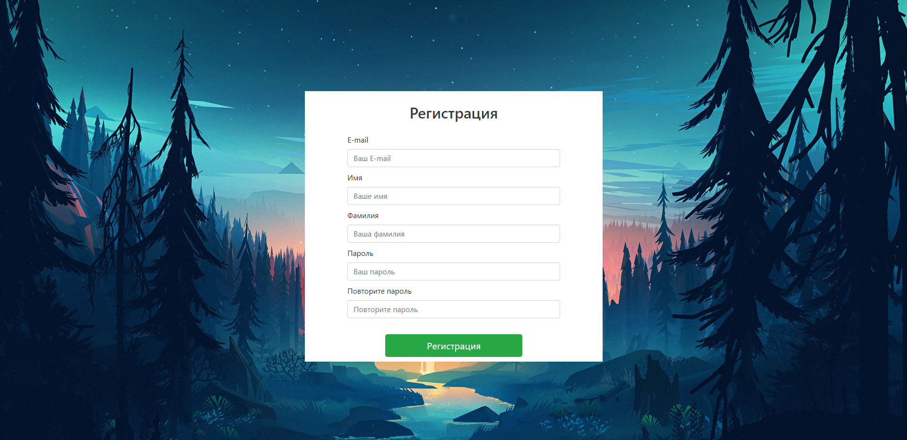

# NIS Volunteers
A website for volunteers club in school with a features as:
1. Registraton/authorization process
2. Rating of volunteers by their volunteer hours
3. Dashboard for volunteers to see their volunteer tasks and get other tasks
4. Dashboard for admins to add new volunteer tasks and see the history of tasks

Screenshots:

